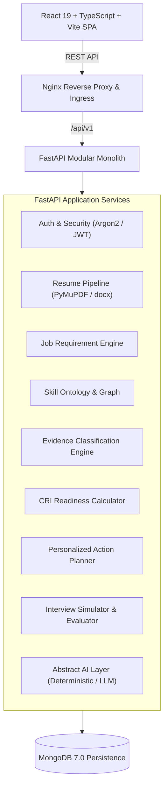

# CareerMetricX — Evidence-Grounded Career Readiness & Interview Intelligence Platform

> **"Measure your skills. Prove your readiness."**

[](https://github.com/)
[](https://python.org)
[](https://fastapi.tiangolo.com)
[](https://mongodb.com)
[](https://react.dev)
[](https://docker.com)
[](LICENSE)

---

## 1. Executive Summary

**CareerMetricX** is an evidence-grounded career readiness and technical interview intelligence platform. Built as a portfolio-grade MCA 3rd-semester project, it tackles the critical failure modes of conventional hiring tech: **keyword stuffing, black-box ATS percentages, and generic mock interview chatbots**.

Rather than treating a skill list as proof of competency, CareerMetricX enforces an auditable, four-stage verification loop:

$$\mathbf{CLAIM} \longrightarrow \mathbf{EVIDENCE} \longrightarrow \mathbf{INTERVIEW} \longrightarrow \mathbf{IMPROVEMENT}$$

### What Makes CareerMetricX Unique?

1. **Skills Listed $\neq$ Demonstrated Experience:** A tool merely listed in a resume's "Skills" section is classified strictly as `MENTIONED` (low confidence). To be classified as `PROVEN`, it must be substantiated by active project narrative, measurable impact, or repository artifacts.
2. **Transferable Competency Mapping:** Leverages a canonical skill ontology to award partial credit when a candidate possesses strong foundational experience in an adjacent technology (e.g., deep Django experience evaluated against a FastAPI requirement).
3. **Grounded Interview Interrogation:** Technical questions are synthesized directly from the candidate's actual projects and identified gaps (e.g., *"In your telemetry project, how did you handle async event loops at 10k events/sec?"*), rather than recycled trivia.
4. **Deterministic Fallback Engine:** Features an abstract AI provider with a zero-cost, rule-based fallback ensuring 100% functionality and test pass rate without paid API keys.

---

## 2. Evidence Categorization Hierarchy

Every requirement in a target Job Description is evaluated against the candidate's resume and categorized into one of four distinct evidence states:

```
┌─────────────────┬──────────────────────────────────────────────────────────────┐
│ Classification  │ Description & Provenance Grounding                           │
├─────────────────┼──────────────────────────────────────────────────────────────┤
│ 🟢 PROVEN       │ Direct, concrete evidence in projects, experience, or certs. │
│ 🔵 TRANSFERABLE │ Adjacent foundational competence identified via ontology.    │
│ 🟡 MENTIONED    │ Listed in keywords/summary without contextual backing.       │
│ 🔴 MISSING      │ Completely absent across all submitted candidate documents.  │
└─────────────────┴──────────────────────────────────────────────────────────────┘
```

---

## 3. High-Level Architecture



---

## 4. Repository Structure

```
CareerMetricX/
├── backend/                   # FastAPI backend modular monolith
│   ├── app/
│   │   ├── api/v1/           # API routes (/health, /auth, /resumes, /jobs...)
│   │   ├── core/             # Configuration, security, database, logging
│   │   ├── schemas/          # Pydantic v2 data models
│   │   ├── services/         # Business logic modules
│   │   ├── repositories/     # Data access layer
│   │   ├── ai/               # Abstract AI provider & deterministic fallback
│   │   └── main.py           # Application entrypoint & lifespan
│   ├── pyproject.toml        # Backend configuration
│   └── requirements.txt      # Python dependencies
├── frontend/                  # React 19 + TypeScript + Vite SPA
│   ├── src/
│   │   ├── components/       # Reusable accessible UI components
│   │   ├── pages/            # Application views
│   │   ├── types/            # Domain TypeScript models
│   │   └── App.tsx           # Navigation & Layout
│   └── package.json          # Node dependencies
├── docs/                      # Comprehensive technical documentation
│   ├── PRD.md                # Product Requirements Document
│   ├── ARCHITECTURE.md       # Detailed System Design & ADRs
│   ├── DATABASE.md           # MongoDB Schemas & Indexes
│   ├── API.md                # RESTful API Specification
│   ├── AI_ENGINE.md          # Intelligence Engine & Scoring Formulas
│   ├── SECURITY.md           # Threat Model & OWASP Hardening
│   ├── TEST_PLAN.md          # Verification Strategy & Fixtures
│   ├── DEPLOYMENT.md         # Docker & Staging/Prod Deployment
│   ├── ROADMAP.md            # 11-Phase Implementation Roadmap
│   └── VIBE_CODING_GUIDE.md  # MCA Viva Defense & Developer Guide
├── infra/                     # Infrastructure as Code
│   ├── docker/               # Multi-stage Dockerfiles & Nginx config
│   └── docker-compose.yml    # Container orchestration
├── tests/                     # Automated test suites
│   ├── backend/              # Pytest tests (auth, parser, ai, scoring)
│   └── conftest.py           # Shared test fixtures
├── scripts/                   # Automation utilities (run_tests.py)
├── .github/workflows/         # GitHub Actions CI workflow
├── .env.example               # Environment variables template
├── docker-compose.yml         # Root compose symlink
└── README.md                  # Project overview
```

---

## 5. Documentation Directory

For complete academic and technical details, consult the dedicated documentation suite:

| Document | Purpose |
| :--- | :--- |
| **[PRD.md](docs/PRD.md)** | Product vision, personas, user stories, non-negotiable principles. |
| **[ARCHITECTURE.md](docs/ARCHITECTURE.md)** | System topology, component boundaries, data flow, ADRs. |
| **[DATABASE.md](docs/DATABASE.md)** | MongoDB document schemas, indexing strategies, collections. |
| **[API.md](docs/API.md)** | Complete OpenAPI/REST contract with payload examples. |
| **[AI_ENGINE.md](docs/AI_ENGINE.md)** | Grounding safeguards, scoring formulas ($R_{cov}, E_{depth}, \text{CRI}$). |
| **[SECURITY.md](docs/SECURITY.md)** | OWASP Top 10 mitigations, JWT auth, file upload hardening. |
| **[TEST_PLAN.md](docs/TEST_PLAN.md)** | Testing pyramid, mandatory proof fixtures, E2E flows. |
| **[DEPLOYMENT.md](docs/DEPLOYMENT.md)** | Multi-stage Docker builds, staging/production setup. |
| **[ROADMAP.md](docs/ROADMAP.md)** | 11-phase implementation plan and acceptance criteria. |
| **[VIBE_CODING_GUIDE.md](docs/VIBE_CODING_GUIDE.md)** | MCA student viva preparation & defense strategy. |

---

## 6. Quickstart Guide

### Option A: Containerized (Docker Compose)
```bash
# 1. Clone repository
git clone https://github.com/your-org/CareerMetricX.git
cd CareerMetricX

# 2. Configure environment
cp .env.example .env

# 3. Spin up full stack
docker compose up --build -d

# 4. Access the platform:
# Web UI:       http://localhost:80 (or :5173 in dev)
# Backend API:  http://localhost:8000/api/v1/health
# Swagger Docs: http://localhost:8000/docs
```

### Option B: Local Native Run
```bash
# 1. Backend setup
python -m venv .venv
source .venv/bin/activate  # On Windows: .venv\Scripts\activate
pip install -r backend/requirements.txt
uvicorn app.main:app --app-dir backend --reload --port 8000

# 2. Frontend setup (in a new terminal)
cd frontend
npm install
npm run dev

# 3. Run automated tests
python scripts/run_tests.py
```

---

## 7. Mathematical Scoring: Career Readiness Index (CRI)

Rather than a single opaque score, CareerMetricX computes a transparent weighted index:

$$\mathbf{CRI} = 0.35 \cdot R_{cov} + 0.35 \cdot E_{depth} + 0.15 \cdot T_{factor} + 0.15 \cdot D_{score}$$

- **$R_{cov}$ (Requirement Coverage):** Proportion of mandatory and preferred skills addressed.
- **$E_{depth}$ (Evidence Depth Index):** Depth of demonstrable project narrative backing claims.
- **$T_{factor}$ (Transferability Factor):** Ontological credit for adjacent technical competencies.
- **$D_{score}$ (Interview Defensibility):** Track record defending technical assertions during simulations.

---

## 8. Academic Project Credentials

- **Project:** MCA 3rd-Semester Project
- **Architecture Standard:** Production-Grade Modular Monolith
- **Focus Areas:** Software Engineering, Distributed Document Persistence, Deterministic NLP, Evidence Provenance, Explainable AI.
