# CareerMetricX — AI & Intelligence Engine Specification

**System Title:** CareerMetricX — Evidence-Grounded Career Readiness & Interview Intelligence Platform  
**Design Principle:** Deterministic Grounding First, AI Augmentation Second  
**Version:** 1.0.0  

---

## 1. Core Philosophical Tenet

> **A generative model must never be the sole source of truth for career qualification or candidate evaluation.**

CareerMetricX deliberately avoids treating Large Language Models (LLMs) as magical black-box arbiters. Instead, the AI Engine acts as a **semantic reasoning and conversational synthesis layer** operating on strictly bounded, pre-parsed deterministic artifacts.

```mermaid
graph LR
    ResumeDoc[Resume Document] --> DeterministicNLP[Deterministic Parser & NLP]
    DeterministicNLP --> ExtractedFacts[Structured Facts & Snippets]
    ExtractedFacts --> GroundedPrompt[Grounded Prompt Construction]
    GroundedPrompt --> AIProvider[AI Provider Interface]
    AIProvider --> StructuredOutput[Constrained JSON Response]
    StructuredOutput --> SchemaValidation[Pydantic v2 Schema Validator]
    SchemaValidation --> UserInspection[Auditable UI Presentation]
```



---

## 2. Pluggable AI Provider Architecture

All AI capabilities are mediated via the abstract base class `BaseAIProvider`.

```python
class BaseAIProvider(ABC):
    @abstractmethod
    async def extract_semantic_requirements(self, text: str) -> ExtractedJobRequirements:
        """Extract structured requirements from unstructured job description."""
        pass

    @abstractmethod
    async def generate_interview_questions(
        self, 
        resume_context: ResumeContext, 
        job_context: JobContext, 
        gaps: list[SkillGap]
    ) -> list[InterviewQuestion]:
        """Synthesize targeted interview questions grounded in actual project claims."""
        pass

    @abstractmethod
    async def evaluate_interview_answer(
        self, 
        question: InterviewQuestion, 
        candidate_answer: str, 
        claimed_context: str
    ) -> AnswerEvaluationResult:
        """Evaluate candidate response across 6 dimensions with consistency checks."""
        pass
```

### 2.1 Provider Implementations

1. **`DeterministicFallbackProvider` (Default / CI / Offline):**
   - Implements 100% of the provider interface using heuristic NLP, rule-based keyword extraction, template-driven question synthesis, and deterministic linguistic scoring.
   - **Cost:** \$0.00.
   - **External Dependencies:** None.
   - **Guarantees:** Zero latency degradation, reliable CI execution, and complete academic reproducibility.

2. **`OpenAICompatibleProvider`:**
   - Interfaces with any OpenAI-compatible HTTP endpoint (OpenAI, Local Ollama, Groq, vLLM, LiteLLM) via asynchronous HTTP client (`httpx`).
   - Uses strict JSON schema enforcement (`response_format={"type": "json_object"}`).
   - Employs exponential backoff with retry limit and strict timeout bounds ($30\text{s}$).

---

## 3. Grounding & Anti-Hallucination Guardrails

To prevent LLMs from inventing resume details or fabricating scores:

1. **Context Clamping:** System prompts receive only verbatim snippets extracted by the document parser. No open-ended web lookups or unverified assumptions.
2. **Prompt Axiom:** "You are an evidence verifier, not an advocate. You must not assume the candidate knows anything not substantiated in the provided context."
3. **Structured Pydantic Validation:** All model outputs must deserialize cleanly into strict Pydantic schemas. If a response contains unexpected fields or violates constraints, it is rejected and handled by the deterministic fallback.
4. **Advisory Attribution:** All evaluative text generated by an LLM is tagged with `"is_advisory": true` in the database and explicitly marked with an info badge in the user interface.

---

## 4. Mathematical Scoring Methodology

Rather than emitting an arbitrary single "ATS percentage", CareerMetricX computes a multi-faceted **Career Readiness Index (CRI)**.

### 4.1 Component Formulas

#### 1. Requirement Coverage Ratio ($R_{cov}$)
Measures what proportion of the target job's mandatory requirements are matched by the candidate:
$$R_{cov} = \frac{\sum_{i=1}^{N_{req}} w_i \cdot \mathbb{I}(s_i \in S_{candidate})}{\sum_{i=1}^{N_{req}} w_i}$$
Where $w_i = 1.0$ for must-have skills, $0.5$ for preferred skills, and $\mathbb{I}$ is an indicator function.

#### 2. Evidence Depth Index ($E_{depth}$)
Measures how thoroughly the matched skills are grounded in tangible project/work narrative rather than mere keywords:
$$E_{depth} = \frac{1}{|M|} \sum_{s \in M} \text{Weight}(\text{Classification}(s))$$
Where weights are assigned as:
- $\text{PROVEN} \implies 1.00$
- $\text{TRANSFERABLE} \implies 0.70$
- $\text{MENTIONED} \implies 0.35$
- $\text{MISSING} \implies 0.00$

#### 3. Interview Defensibility Score ($D_{score}$)
Reflects the candidate's demonstrated ability to articulate and defend their assertions during simulated technical interviews:
$$D_{score} = \frac{1}{K} \sum_{k=1}^{K} \left( 0.25 \cdot \text{Rel}_k + 0.30 \cdot \text{Tech}_k + 0.25 \cdot \text{Spec}_k + 0.20 \cdot \text{Consist}_k \right)$$

#### 4. Composite Career Readiness Index (CRI)
$$\text{CRI} = 0.35 \cdot R_{cov} + 0.35 \cdot E_{depth} + 0.15 \cdot T_{factor} + 0.15 \cdot D_{score}$$

All parameters are transparently displayed in the analysis dashboard alongside their component breakdowns.
