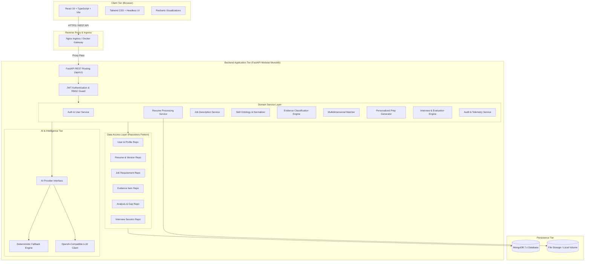
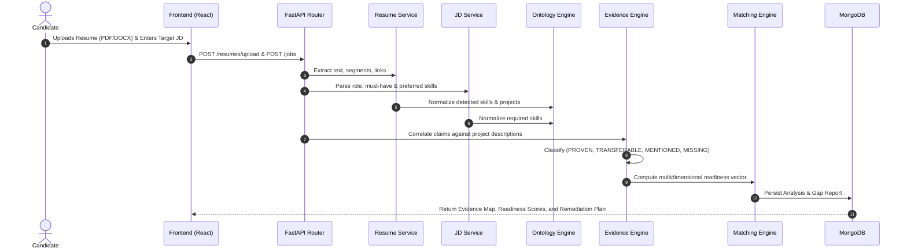
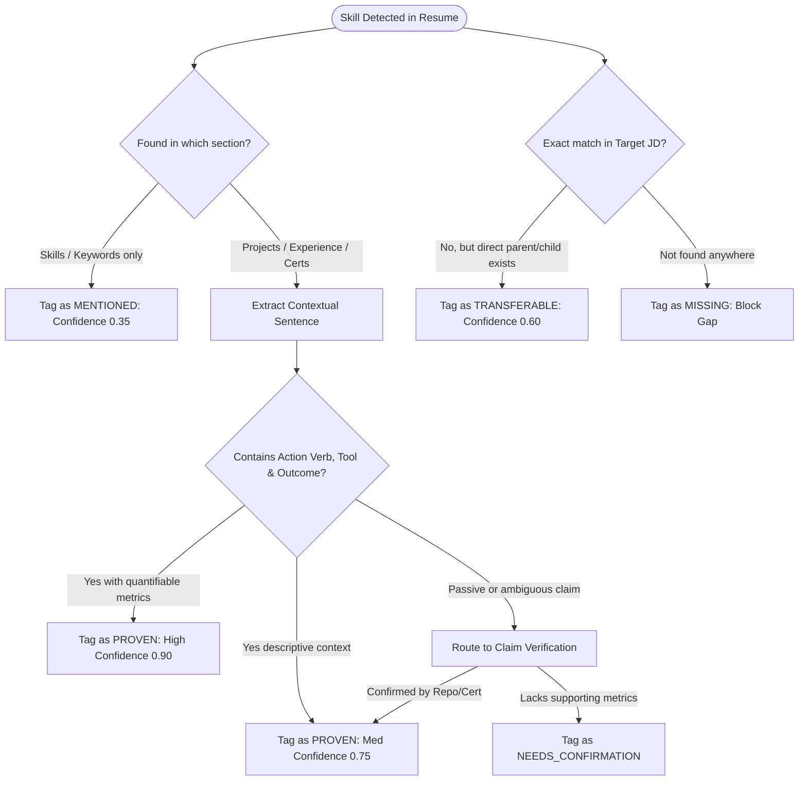

# CareerMetricX — System Architecture Document

**System Title:** CareerMetricX — Evidence-Grounded Career Readiness & Interview Intelligence Platform  
**Architecture Pattern:** Layered Modular Monolith (Clean Architecture)  
**Version:** 1.0.0  

---

## 1. Architectural Vision & Topology

CareerMetricX is designed as a **production-grade, layered modular monolith**. It combines high developer velocity, clear operational boundaries, and zero unnecessary microservice overhead while preserving strict separation of concerns.

### 1.1 High-Level Architecture Diagram



---

## 2. Layered Component Architecture

The backend strictly enforces unidirectional dependencies following Clean Architecture principles:

$$\text{API Routes (Presentation)} \longrightarrow \text{Schemas (DTOs)} \longrightarrow \text{Domain Services} \longrightarrow \text{Repositories} \longrightarrow \text{MongoDB Driver}$$

```
backend/
├── app/
│   ├── main.py              # Application entrypoint & lifespan
│   ├── core/                # Configuration, security, logging, exceptions
│   │   ├── config.py        # Pydantic v2 BaseSettings
│   │   ├── security.py      # Passwords, JWT encoding/decoding
│   │   ├── database.py      # Async Motor client management
│   │   └── logging.py       # Structured JSON logging
│   ├── api/                 # API routing layer
│   │   ├── deps.py          # FastApi Dependency injection (DB, Current User)
│   │   └── v1/              # Versioned API routes
│   │       ├── router.py    # Master router
│   │       ├── auth.py
│   │       ├── users.py
│   │       ├── resumes.py
│   │       ├── jobs.py
│   │       ├── analysis.py
│   │       ├── evidence.py
│   │       ├── preparation.py
│   │       ├── interviews.py
│   │       └── admin.py
│   ├── schemas/             # Pydantic models for request validation & response serialization
│   ├── services/            # Pure business logic isolated from HTTP concerns
│   ├── repositories/        # MongoDB query abstraction
│   ├── ai/                  # Abstract provider interface & implementations
│   │   ├── base.py          # Abstract BaseAIProvider
│   │   ├── deterministic.py # Zero-cost rule-based provider
│   │   ├── openai_client.py # OpenAI-compatible client
│   │   └── prompts.py       # Grounded system prompts
│   └── ontology/            # Canonical skill dictionary and graph
```

---

## 3. End-to-End Data Flow Pipeline

The end-to-end data processing follows an evidence-grounded workflow:



---

## 4. Evidence Classification Pipeline

The hallmark of CareerMetricX is the strict separation between mere assertion and substantiated proof:



---

## 5. Architectural Decision Records (ADRs)

### ADR-001: Modular Monolith vs Microservices
- **Decision:** Build CareerMetricX as a modular monolith within a single FastAPI backend service rather than decomposing into 5+ microservices.
- **Rationale:** Microservices introduce distributed transactions, network latency, serialization overhead, and deployment complexity that obscure business logic in an academic/portfolio setting. Modular monolith provides clean code boundaries with simple zero-network in-process communication.
- **Extension Path:** Because domain boundaries are enforced via service classes and repositories, any module (e.g., `InterviewEngine`) can be extracted into an independent microservice later if traffic warrants.

### ADR-002: MongoDB Document Database vs Relational SQL
- **Decision:** Utilize MongoDB with the Motor async driver for primary persistence.
- **Rationale:** Resumes and Job Descriptions possess deeply nested, semi-structured, and polymorphic schemas (sections, variable-length project bullet points, dynamic evidence provenance trees, flexible interview evaluations). Document modeling prevents dozens of complex relational joins while allowing rich indexing on nested fields.
- **Integrity Guarantee:** Schema integrity is enforced at the application boundary via strict Pydantic v2 models before any write operation.

### ADR-003: Abstract AI Provider with Deterministic Fallback
- **Decision:** Abstract all generative AI and semantic inference capabilities behind an abstract base class (`BaseAIProvider`).
- **Rationale:** External AI APIs introduce network flakiness, rate limits, latency, and subscription costs. By developing a deterministic rule-based fallback provider, the entire platform remains 100% runnable, testable, and demonstrable in offline environments and GitHub Actions CI.

### ADR-004: Evidence Categorization Hierarchy
- **Decision:** Reject binary "match / no match" ATS scores in favor of a 4-tier capability classification (`PROVEN`, `TRANSFERABLE`, `MENTIONED`, `MISSING`).
- **Rationale:** A candidate claiming "Docker" in a skills list has not demonstrated the same competency as a candidate who wrote "Configured multi-stage Docker builds reducing image size by 65%". CareerMetricX makes this qualitative difference visible and measurable.

---

## 6. Future Extensibility: Placement Cell / Institutional Role

To accommodate institutional deployment (e.g., University Placement Cells) without architectural refactoring:
1. **Tenant/Cohort Partitioning:** The `User` and `Analysis` collections include optional `institution_id` and `cohort_id` attributes.
2. **Role Enumeration:** The RBAC system is pre-architected with `RoleEnum.PLACEMENT_OFFICER` alongside `CANDIDATE` and `ADMIN`.
3. **Cohort Aggregation Queries:** The repository layer provides cohort-level aggregation methods (e.g., `get_cohort_skill_deficits(cohort_id)`).
