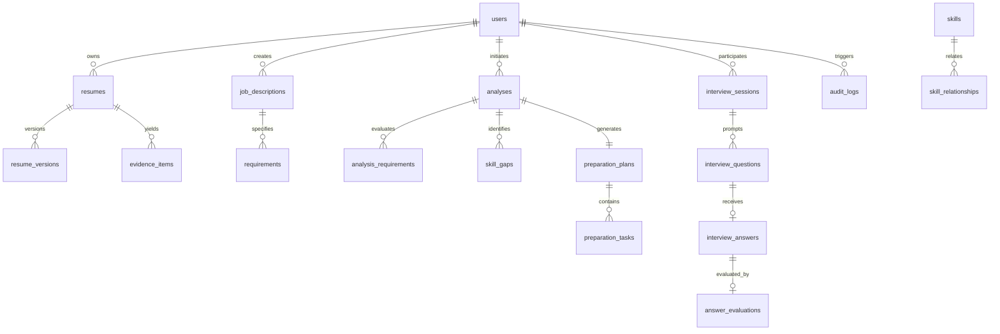

# CareerMetricX — Database Specification Document

**System Title:** CareerMetricX — Evidence-Grounded Career Readiness & Interview Intelligence Platform  
**Database Engine:** MongoDB 7.x (Document Database)  
**Driver:** Motor (AsyncIO MongoDB Driver for Python)  
**Schema Validation:** Pydantic v2 Models at Application Layer + MongoDB JSON Schema Validators  
**Version:** 1.0.0  

---

## 1. Overview & Data Modeling Strategy

CareerMetricX stores semi-structured, nested domain entities such as parsed resumes, complex job descriptions, evidence provenance trees, and multi-turn interview interactions.

### 1.1 Embedded vs. Referenced Strategy
- **Embedded Documents:** Used for bounded, closely coupled entities that are queried and mutated together (e.g., resume sections, education history, interview question answer pairs).
- **Referenced Collections:** Used for unbounded, independently queried, or shared domain entities (e.g., users, canonical skills, job descriptions, analysis snapshots, audit logs).

---

## 2. Collection Specifications & Entity Schemas



### 2.1 Collection: `users`
Stores user identities, hashed credentials, roles, and status flags.

```json
{
  "_id": "ObjectId",
  "email": "candidate@example.com",
  "hashed_password": "$argon2id$v=19$m=65536,t=3,p=4$...",
  "full_name": "Ada Lovelace",
  "role": "CANDIDATE", // "CANDIDATE" | "ADMIN" | "PLACEMENT_OFFICER"
  "is_active": true,
  "is_verified": false,
  "institution_id": null,
  "created_at": "ISODate()",
  "updated_at": "ISODate()"
}
```
**Indexes:**
- `{ "email": 1 }` (Unique)
- `{ "role": 1, "is_active": 1 }`
- `{ "institution_id": 1 }` (Sparse)

---

### 2.2 Collection: `profiles`
Extended profile information for the candidate.

```json
{
  "_id": "ObjectId",
  "user_id": "ObjectId",
  "headline": "Full-Stack Developer & Distributed Systems Enthusiast",
  "target_roles": ["Backend Engineer", "Full-Stack Engineer"],
  "experience_years": 2.5,
  "github_username": "adalovelace",
  "linkedin_url": "https://linkedin.com/in/adalovelace",
  "preferred_locations": ["Remote", "Bangalore"],
  "updated_at": "ISODate()"
}
```
**Indexes:**
- `{ "user_id": 1 }` (Unique)

---

### 2.3 Collection: `resumes` & `resume_versions`
`resumes` acts as the aggregate root for a candidate's uploaded resumes. `resume_versions` retains immutable snapshots of processed document states.

```json
// resumes collection
{
  "_id": "ObjectId",
  "user_id": "ObjectId",
  "title": "Master Backend Resume 2026",
  "current_version_id": "ObjectId",
  "total_versions": 1,
  "created_at": "ISODate()",
  "updated_at": "ISODate()"
}

// resume_versions collection
{
  "_id": "ObjectId",
  "resume_id": "ObjectId",
  "version_number": 1,
  "file_metadata": {
    "original_filename": "Ada_Lovelace_Resume.pdf",
    "mime_type": "application/pdf",
    "file_size_bytes": 1048576,
    "storage_path": "storage/uploads/..."
  },
  "raw_text": "...",
  "parsed_structure": {
    "summary": "...",
    "contact": { "email": "...", "phone": "..." },
    "education": [
      {
        "institution": "National Institute of Technology",
        "degree": "MCA",
        "start_year": 2024,
        "end_year": 2026,
        "gpa": "8.8/10"
      }
    ],
    "experience": [
      {
        "company": "Tech Corp",
        "title": "Backend Intern",
        "start_date": "2025-01",
        "end_date": "2025-06",
        "highlights": ["Built async pipeline in FastAPI..."]
      }
    ],
    "projects": [
      {
        "name": "CloudMetric",
        "technologies": ["Python", "FastAPI", "Docker", "PostgreSQL"],
        "description": "Engineered real-time telemetry pipeline handling 10k events/sec.",
        "repo_url": "https://github.com/..."
      }
    ],
    "declared_skills": ["Python", "FastAPI", "Docker", "PostgreSQL", "React"]
  },
  "created_at": "ISODate()"
}
```
**Indexes:**
- `{ "user_id": 1, "created_at": -1 }` on `resumes`
- `{ "resume_id": 1, "version_number": -1 }` on `resume_versions`

---

### 2.4 Collection: `job_descriptions`
Target job postings ingested from user paste or file upload.

```json
{
  "_id": "ObjectId",
  "user_id": "ObjectId",
  "title": "Senior Backend Software Engineer",
  "company_name": "FinTech Innovations",
  "raw_content": "...",
  "parsed_structure": {
    "seniority_level": "Mid-Senior",
    "must_have_skills": ["Python", "FastAPI", "MongoDB", "Docker"],
    "preferred_skills": ["Kubernetes", "Redis", "Kafka"],
    "min_experience_years": 2,
    "responsibilities": ["Design low-latency microservices..."],
    "soft_skills": ["System design articulation", "Cross-team communication"]
  },
  "created_at": "ISODate()"
}
```
**Indexes:**
- `{ "user_id": 1, "created_at": -1 }`
- `{ "parsed_structure.must_have_skills": 1 }`

---

### 2.5 Collection: `skills` (Canonical Taxonomy) & `skill_relationships`

```json
// skills collection
{
  "_id": "ObjectId",
  "canonical_name": "FastAPI",
  "slug": "fastapi",
  "category": "Backend Framework",
  "aliases": ["fast-api", "Fast API", "fastapi framework"],
  "description": "High-performance Python web framework for building APIs.",
  "is_verified": true
}

// skill_relationships collection
{
  "_id": "ObjectId",
  "source_skill_id": "ObjectId", // FastAPI
  "target_skill_id": "ObjectId", // Python
  "relationship_type": "CHILD_OF", // "CHILD_OF" | "RELATED_TO" | "COMPLEMENTS"
  "strength": 0.95
}
```
**Indexes:**
- `{ "slug": 1 }` (Unique)
- `{ "aliases": 1 }`
- `{ "source_skill_id": 1, "target_skill_id": 1 }` (Unique on relationships)

---

### 2.6 Collection: `evidence_items`
Stores extracted proof points grounding candidate capability claims.

```json
{
  "_id": "ObjectId",
  "user_id": "ObjectId",
  "resume_version_id": "ObjectId",
  "skill_name": "FastAPI",
  "skill_id": "ObjectId",
  "classification": "PROVEN", // "PROVEN" | "TRANSFERABLE" | "MENTIONED" | "MISSING"
  "source_section": "Projects",
  "source_text": "Engineered real-time telemetry pipeline in FastAPI handling 10k events/sec.",
  "confidence_score": 0.88,
  "strength": "STRONG", // "STRONG" | "MODERATE" | "WEAK"
  "created_at": "ISODate()"
}
```
**Indexes:**
- `{ "resume_version_id": 1, "skill_name": 1 }`
- `{ "user_id": 1, "classification": 1 }`

---

### 2.7 Collection: `analyses` & `skill_gaps`
Stores multidimensional evaluation results matching a resume against a target job description.

```json
// analyses collection
{
  "_id": "ObjectId",
  "user_id": "ObjectId",
  "resume_version_id": "ObjectId",
  "job_description_id": "ObjectId",
  "metrics": {
    "requirement_coverage": 0.80,
    "evidence_strength": 0.72,
    "transferability_score": 0.65,
    "interview_defensibility": 0.85,
    "overall_readiness_score": 0.76
  },
  "summary": "Strong core backend alignment with clear evidence in FastAPI; Docker and Redis require verification.",
  "created_at": "ISODate()"
}

// skill_gaps collection
{
  "_id": "ObjectId",
  "analysis_id": "ObjectId",
  "skill_name": "Kafka",
  "gap_type": "MISSING", // "MISSING" | "WEAK_EVIDENCE" | "TRANSFERABLE_SUBSTITUTE"
  "severity": "CRITICAL", // "CRITICAL" | "MODERATE" | "OPTIONAL"
  "remediation_rationale": "Kafka is mandated for event streaming in the target JD with zero evidence present in resume."
}
```
**Indexes:**
- `{ "user_id": 1, "created_at": -1 }`
- `{ "analysis_id": 1 }` on `skill_gaps`

---

### 2.8 Collection: `preparation_plans` & `preparation_tasks`
Generates actionable steps and proof artifact goals for candidate gaps.

```json
// preparation_plans collection
{
  "_id": "ObjectId",
  "analysis_id": "ObjectId",
  "user_id": "ObjectId",
  "status": "IN_PROGRESS", // "NOT_STARTED" | "IN_PROGRESS" | "COMPLETED"
  "completion_percentage": 25.0,
  "created_at": "ISODate()"
}

// preparation_tasks collection
{
  "_id": "ObjectId",
  "plan_id": "ObjectId",
  "skill_name": "Docker",
  "title": "Containerize telemetry pipeline with multi-stage build",
  "rationale": "Target role requires containerized production deployments.",
  "action_instruction": "Create Dockerfile and docker-compose.yml demonstrating network isolation.",
  "proof_artifact": "Dockerfile + docker-compose.yml in public GitHub repository",
  "interview_checkpoint": "Be prepared to explain difference between CMD and ENTRYPOINT, and layer caching.",
  "is_completed": false,
  "verified_at": null
}
```
**Indexes:**
- `{ "analysis_id": 1 }` (Unique on plan)
- `{ "plan_id": 1, "is_completed": 1 }`

---

### 2.9 Collection: `interview_sessions`, `interview_questions`, `answer_evaluations`
Multi-turn conversational simulation state and grounded answer assessments.

```json
// interview_sessions collection
{
  "_id": "ObjectId",
  "user_id": "ObjectId",
  "analysis_id": "ObjectId",
  "mode": "TECHNICAL_DEEP_DIVE", // "TECHNICAL_DEEP_DIVE" | "RESUME_VERIFICATION" | "GAP_CHALLENGE" | "HR"
  "status": "COMPLETED", // "ACTIVE" | "COMPLETED" | "ABANDONED"
  "total_score": 82.5,
  "started_at": "ISODate()",
  "completed_at": "ISODate()"
}

// interview_questions collection
{
  "_id": "ObjectId",
  "session_id": "ObjectId",
  "question_index": 1,
  "targeted_skill": "FastAPI",
  "targeted_evidence_id": "ObjectId",
  "question_text": "In your CloudMetric project, you achieved 10k events/sec with FastAPI. How did you structure the asynchronous event loop and prevent blocking I/O calls?",
  "evaluation_criteria": ["Asynchronous concurrency comprehension", "Knowledge of asyncio / threadpools"]
}

// answer_evaluations collection
{
  "_id": "ObjectId",
  "question_id": "ObjectId",
  "candidate_answer": "I utilized FastAPI's async def route handlers along with asyncpg for non-blocking database queries...",
  "scores": {
    "relevance": 9.0,
    "technical_correctness": 8.5,
    "completeness": 8.0,
    "specificity": 8.5,
    "clarity": 8.0,
    "resume_consistency": 9.5
  },
  "strengths": ["Clear articulation of async driver usage", "Consistent with project claim"],
  "missing_points": ["Did not mention connection pooling settings"],
  "improvement_feedback": "Explain how connection pools are sized relative to worker count.",
  "is_advisory": true
}
```
**Indexes:**
- `{ "user_id": 1, "created_at": -1 }` on `interview_sessions`
- `{ "session_id": 1, "question_index": 1 }` on `interview_questions`

---

### 2.10 Collection: `audit_logs`
Immutable logging for security, compliance, and academic auditability.

```json
{
  "_id": "ObjectId",
  "user_id": "ObjectId",
  "action": "RESUME_UPLOAD",
  "ip_address": "192.168.1.10",
  "user_agent": "Mozilla/5.0 ...",
  "resource_type": "resume",
  "resource_id": "ObjectId",
  "status": "SUCCESS",
  "details": { "file_size": 1048576, "format": "PDF" },
  "timestamp": "ISODate()"
}
```
**Indexes:**
- `{ "timestamp": -1 }`
- `{ "user_id": 1, "timestamp": -1 }`
- `{ "action": 1 }`

---

## 3. Database Migration & Initialization Strategy

1. **Deterministic Index Initialization:** On application startup, `app.core.database.init_db()` runs declarative index builds ensuring all indexes exist without blocking operational traffic.
2. **Schema Version Tracking:** Stored in a meta-collection `schema_versions`:
   ```json
   { "version": "1.0.0", "applied_at": "ISODate()", "migration_script": "001_initial_schema.py" }
   ```
3. **Seed Data:** Default canonical skill taxonomy and ontological relationships are automatically seeded on startup if the `skills` collection is empty.
