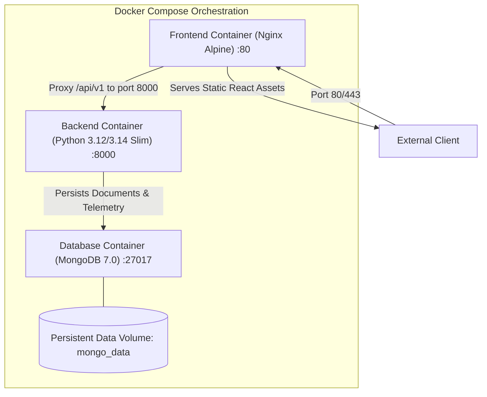

# CareerMetricX — Deployment & Infrastructure Guide

**System Title:** CareerMetricX — Evidence-Grounded Career Readiness & Interview Intelligence Platform  
**Target Environments:** Local Containerized Dev, Staging, Cloud Production (Docker Compose / Render / AWS)  
**Version:** 1.0.0  

---

## 1. Containerization Architecture

CareerMetricX provides production-ready, multi-stage Docker configurations to ensure consistent operation across local development and cloud production.



---

## 2. Service Specifications

### 2.1 Backend Service (`Dockerfile.backend`)
- **Base Image:** `python:3.12-slim` (or `python:3.14-slim`)
- **Security:** Runs as non-root user `appuser:appgroup`
- **Multi-stage:** Dependency installation separated from application runtime
- **Health Check:** `curl -f http://localhost:8000/api/v1/health || exit 1`

### 2.2 Frontend Service (`Dockerfile.frontend`)
- **Stage 1 (Build):** `node:20-alpine` runs `npm ci && npm run build`
- **Stage 2 (Runtime):** `nginx:1.27-alpine` serves optimized production assets
- **Security:** Non-root execution, minimal attack surface, Gzip compression enabled
- **SPA Routing:** Configured `try_files $uri $uri/ /index.html;` to support React Router client-side paths.

### 2.3 Persistence Tier (`mongo`)
- **Base Image:** `mongo:7.0`
- **Volume:** Named volume `mongo_data` mounted at `/data/db`
- **Authentication:** Enabled via `MONGO_INITDB_ROOT_USERNAME` and password in staging/prod.

---

## 3. Local Development Quickstart

### Prerequisites
- Docker Engine $\ge 24.0$ & Docker Compose $\ge v2$
- (Alternatively for local native run: Python 3.11+, Node.js 20+, MongoDB running locally)

### Steps
```bash
# 1. Clone the repository
git clone https://github.com/your-org/CareerMetricX.git
cd CareerMetricX

# 2. Copy the environment template
cp .env.example .env

# 3. Spin up the full containerized stack
docker compose -f infra/docker-compose.yml up --build -d

# 4. Inspect container health
docker compose -f infra/docker-compose.yml ps

# 5. Access the application:
# Frontend UI: http://localhost:5173 (or http://localhost:80 via reverse proxy)
# Backend Swagger Docs: http://localhost:8000/docs
# API Health Check: http://localhost:8000/api/v1/health
```

---

## 4. Production Hardening Checklist

| Domain | Hardening Requirement | Implementation Status |
| :--- | :--- | :--- |
| **Secrets** | Replace default `SECRET_KEY` with 64-char random hex | Enforced via startup assertion |
| **CORS** | Restrict `BACKEND_CORS_ORIGINS` to exact production domain | Configured in `.env` |
| **Database** | Require username/password auth on MongoDB | Injected via secrets manager |
| **TLS/SSL** | Terminate HTTPS at Cloudflare or Nginx reverse proxy | Enforced via Nginx config |
| **File Size** | Clamped to 10MB to prevent memory exhaustion | Configured in FastAPI & Nginx |
| **Logs** | Structured JSON logs streaming to stdout/stderr | Implemented in `app.core.logging` |

---

## 5. Backup & Disaster Recovery

### MongoDB Dump Routine
```bash
# Create timestamped database backup
docker exec careermetricx_db mongodump \
  --db careermetricx_prod \
  --archive=/data/db/backup_$(date +%Y%m%d_%H%M%S).gz \
  --gzip

# Restore routine
docker exec -i careermetricx_db mongorestore \
  --db careermetricx_prod \
  --archive=/data/db/backup_YYYYMMDD_HHMMSS.gz \
  --gzip
```
