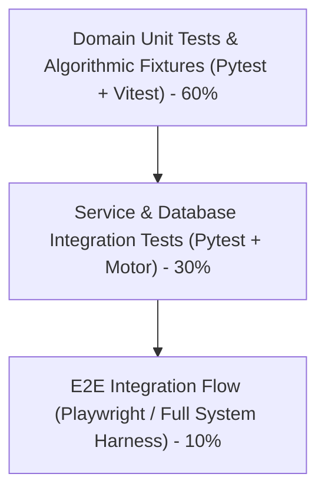

# CareerMetricX — Comprehensive Test Plan & Verification Strategy

**System Title:** CareerMetricX — Evidence-Grounded Career Readiness & Interview Intelligence Platform  
**Target Quality Level:** Portfolio-Grade Academic & Production Rigor  
**Version:** 1.0.0  

---

## 1. Testing Pyramid & Verification Philosophy



Every claim made by the platform must be backed by automated test suites. We reject superficial tests that assert only mock invocations; tests must assert on **real domain logic, mathematical correctness, and evidence classification constraints**.

---

## 2. Mandatory Verification Fixtures

The platform mandates specific test fixtures to substantiate our academic differentiator:

### 2.1 Fixture 1: Skills Section Alone $\ne$ Demonstrated Evidence
- **Scenario:** Candidate resume contains `Python, Docker, Kubernetes` in the `Skills` block, but the `Projects` and `Experience` sections only describe building HTML/CSS websites.
- **Assertion:**
  - `Docker` and `Kubernetes` must be categorized as `MENTIONED`.
  - Evidence confidence must not exceed $0.40$.
  - Analysis must flag a critical gap if the JD demands production Docker experience.

### 2.2 Fixture 2: Project Narrative Substantiation
- **Scenario:** Candidate describes: *"Engineered async FastAPI telemetry pipeline handling 10,000 events/sec backed by PostgreSQL and Docker Compose."*
- **Assertion:**
  - `FastAPI`, `PostgreSQL`, and `Docker` must be classified as `PROVEN`.
  - Source section must record `"Projects"`.
  - Evidence confidence must exceed $0.75$.

### 2.3 Fixture 3: Transferable Competency Recognition
- **Scenario:** Target JD demands `FastAPI`. Candidate has zero FastAPI mentions, but documents 2 years of deep experience building microservices with `Django` and `Python`.
- **Assertion:**
  - Capability must be classified as `TRANSFERABLE`.
  - The rationale must explicitly explain: *"Django provides strong architectural transferability to FastAPI via shared Python web paradigms."*

### 2.4 Fixture 4: Unsupported Quantitative Claims Flagging
- **Scenario:** Resume states: *"Optimized company-wide database latency by 85% with zero downtime."* but has no supporting project details, tools, or architectural explanation.
- **Assertion:**
  - Claim verification engine must flag the assertion as `NEEDS_CONFIRMATION` or `UNSUPPORTED`.
  - Interview engine must prioritize this claim for interview interrogation.

---

## 3. Backend Test Matrix

| Module | Test File | Test Scenarios |
| :--- | :--- | :--- |
| **Auth** | `tests/backend/test_auth.py` | Registration, duplicate email rejection, Argon2 password hashing, valid/invalid JWT, token expiry |
| **Security** | `tests/backend/test_security.py` | SQL/NoSQL injection payload rejection, XSS escaping, ownership authorization guards |
| **Resume Parser** | `tests/backend/test_resume_parser.py` | PDF parsing, DOCX parsing, TXT parsing, corrupted file handling, oversized file rejection |
| **JD Parser** | `tests/backend/test_jd_parser.py` | Must-have vs nice-to-have skill extraction, responsibility parsing, seniority detection |
| **Ontology** | `tests/backend/test_ontology.py` | Canonical alias normalization, parent-child traversal, sibling relationship lookups |
| **Evidence Engine**| `tests/backend/test_evidence.py` | 4-tier classification, context preservation, confidence computation |
| **Matching Engine**| `tests/backend/test_matching.py` | $R_{cov}$, $E_{depth}$, $T_{factor}$, $D_{score}$, CRI calculations against manual baselines |
| **Preparation** | `tests/backend/test_preparation.py` | Actionable task generation, proof artifact requirements, checkpoint assignment |
| **Interview Engine**| `tests/backend/test_interview.py`| Question synthesis grounded in project text, answer evaluation across 6 metrics |

---

## 4. Frontend Verification Strategy

- **Tooling:** Vitest + React Testing Library + Vite.
- **Component Tests:**
  - `EvidenceBadge`: Renders distinctive colors and labels for `PROVEN`, `TRANSFERABLE`, `MENTIONED`, `MISSING`.
  - `ScoreRadar`: Correctly plots the 5 dimensions of readiness.
  - `InterviewSimulator`: Handles question advancement, timer, loading skeletons, and answer submission.
- **Accessibility Checks:** All interactive elements must have unique `id` and `aria-label` attributes for screen readers and automated test harnesses.

---

## 5. End-to-End (E2E) Workflow Harness

Automated integration test executing the complete user journey:
1. **Register** a new candidate account.
2. **Login** and receive JWT tokens.
3. **Upload** sample resume (`fixtures/sample_resume.pdf`).
4. **Create** target job description (`fixtures/sample_jd.txt`).
5. **Trigger** capability analysis.
6. **Inspect** evidence map and verify `FastAPI` is `PROVEN` and `Kubernetes` is `MISSING`.
7. **Inspect** generated preparation plan and confirm targeted remediation tasks.
8. **Start** simulated interview session and receive first contextual question.
9. **Submit** candidate answer.
10. **Verify** multidimensional evaluation returned with advisory label.
11. **Check** updated progress event recorded in candidate history.

---

## 6. Execution Commands

```bash
# Run backend test suite
pytest tests/backend/ -v --cov=app --cov-report=term-missing

# Run frontend test suite
cd frontend && npm test -- --run

# Run full CI verification script
python scripts/run_tests.py
```
